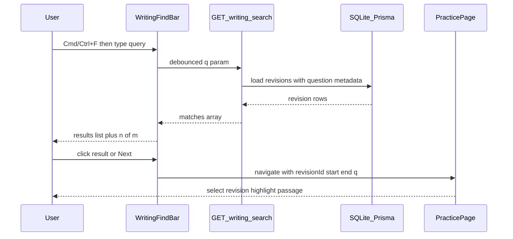
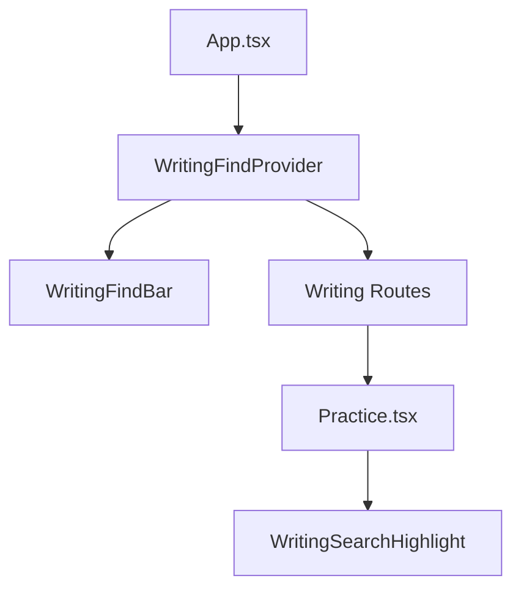

# feat: Global writing search (Cmd/Ctrl+F)

## Summary

Add a Writing-module-wide find bar triggered by **Cmd/Ctrl+F** that searches all saved essay revisions across every question, lists matches with context snippets, and deep-links into Practice to show the matched passage.

## Problem Frame

Users expect familiar in-app find (like Word or Google Docs) over their own writing corpus. Browser find searches unrelated page chrome (prompts, timers, feedback). Today there is no API or UI to search `SubmissionRevision.text` across questions.

## Requirements

- R1. **Cmd/Ctrl+F on Writing routes** opens an in-app find bar and prevents the browser default page find. Writing routes are `/`, `/practice/:id`, and `/errors`. Speaking routes keep native browser find.
- R2. **Corpus-wide search** scans every `SubmissionRevision.text` for all questions. Matching is case-insensitive substring search.
- R3. **Find bar controls** include search input, match count (`n of m`), Previous, Next, and Esc to dismiss.
- R4. **Results list** shows question title, question type (Email / Academic), revision label (Latest / Version N), and a snippet with the match highlighted.
- R5. **Result navigation** clicking a result navigates to `/practice/:questionId` with query params that restore revision context and scroll to the match. Prev/Next and Enter cycle the active result in the list without leaving the current page.
- R6. **Match highlighting on Practice** visibly marks the matched passage: in the essay textarea for the latest revision; in a dedicated highlight panel above the diff for historical revisions (see KTD3).
- R7. **Live search** updates results as the user types, debounced (~250ms). Empty query shows no results.
- R8. **Enter** advances to the next match when the find bar is open (wraps to first after last).
- R9. **Result cap** returns at most 200 matches from the API; UI shows all returned matches with a truncation notice when capped.

## Key Technical Decisions

- KTD1. **Server-side search endpoint** — `GET /api/writing-search?q=...` runs match extraction in the backend. Rationale: keeps search logic testable in one place, avoids shipping full revision texts to the client on every keystroke, and scales better than client-side corpus fetch as revisions grow.
- KTD2. **Writing-only shortcut interception** — `WritingFindProvider` wraps Writing routes and registers `keydown` for Cmd/Ctrl+F only when `location.pathname` does not start with `/speaking`. Rationale: matches scope boundary; Speaking module unchanged.
- KTD3. **Historical revision highlight via snippet panel, not ReactDiffViewer DOM** — ReactDiffViewer renders diff HTML that is awkward to decorate. For non-latest revisions, Practice renders a `WritingSearchHighlight` block (revision text with `<mark>` at offsets) above the diff when arriving via find deep-link. Latest revision uses textarea `setSelectionRange` + scrollIntoView. Rationale: reliable highlight without forking the diff library.
- KTD4. **Deep-link query contract** — `?revisionId=<id>&start=<offset>&end=<offset>&q=<encoded>` on `/practice/:id`. Practice reads params on mount, selects the revision (sets `selectedRevision` / `comparisonBase`), applies highlight, then clears params with `replace` to avoid sticky state on refresh.
- KTD5. **Search logic in shared module** — `backend/src/lib/writingSearch.ts` exports pure functions for match iteration and snippet building; the Express route is a thin wrapper. Rationale: mirrors `backend/src/lib/errorTypes.ts` pattern; enables fast unit tests without HTTP.

## High-Level Technical Design



**Component topology**



---

## Scope Boundaries

**In scope:** Writing module find UI, search API, Practice deep-link + highlight, integration tests for API and unit tests for search lib + find components.

**Out of scope (v1):**

- Speaking transcripts and Speaking routes
- Searching prompts, AI feedback, or error-log explanation text
- Per-question scope filters
- Replace / replace-all
- Full-text filters (date, question type)

### Deferred to Follow-Up Work

- SQLite FTS5 index if revision count makes linear scan slow
- Persist last search query across sessions
- Keyboard shortcut hint in nav UI

---

## Implementation Units

### U1. Writing search library and API

**Goal:** Expose a tested backend endpoint that returns ranked match records across all revisions.

**Requirements:** R2, R9

**Dependencies:** none

**Files:**

- `backend/src/lib/writingSearch.ts` (create)
- `backend/src/lib/writingSearch.test.ts` (create)
- `backend/src/index.ts` (modify — add route)
- `backend/src/index.integration.test.ts` (modify — add HTTP tests)

**Approach:**

- Add `findWritingMatches(query: string, revisions: RevisionSearchRow[], options?: { limit?: number })` pure function.
- `RevisionSearchRow` shape: `{ revisionId, revisionText, revisionCreatedAt, submissionId, questionId, questionTitle, questionType }`.
- Fetch all revisions with question metadata, then **group by `questionId`** and assign `revisionIndex` (0 = newest) within each group — matching `revisionInclude` newest-first ordering. Do not rely on a single global `orderBy: { createdAt: 'desc' }` alone; that interleaves revisions across questions.
- For each revision, find all occurrences (overlapping is fine for v1).
- Each match record includes: `questionId`, `questionTitle`, `questionType`, `revisionId`, `revisionIndex`, `revisionLabel` (`LATEST` when `revisionIndex === 0`, else `VERSION ${revisionCount - revisionIndex}` — same convention as Practice history buttons), `startOffset`, `endOffset`, `snippet`.
- Build snippet: ~40 chars before/after match, ellipsis when truncated.
- `GET /api/writing-search?q=` — require `q` trimmed length 2–200; return 400 if missing, too short, or too long.

```text
submissionRevision.findMany({
  include: { submission: { include: { question: true } } },
  orderBy: { createdAt: 'desc' }
})
```

- Map to search rows, call `findWritingMatches`, return `{ matches, total, truncated }` where `total` is the **full** match count before the 200-match cap.
- Cap at 200 matches in the `matches` array; set `truncated: true` when `total > 200`.

**Patterns to follow:** `backend/src/lib/errorTypes.ts` + `errorTypes.test.ts`; existing route style in `backend/src/index.ts`; `requireApiKey` on all `/api/*` routes.

**Test scenarios:**

- Happy path: query `"climate"` returns matches from multiple questions with correct `questionId`, `revisionId`, offsets, and snippet containing the term.
- Case insensitivity: `"CLIMATE"` matches `"climate"`.
- Empty / whitespace query: API returns 400.
- Query shorter than 2 characters after trim: API returns 400.
- Query longer than 200 characters: API returns 400.
- No submissions: returns `{ matches: [], total: 0, truncated: false }`.
- Truncation: seed >200 occurrences across revisions; response has 200 matches and `truncated: true`.
- Integration: authenticated `GET /api/writing-search?q=word` returns 200 with expected shape after creating question + submission via existing POST flow.

**Verification:** `npm test` in `backend/` passes; manual curl with API key returns matches for seeded data.

---

### U2. Shared frontend types and search client

**Goal:** Typed API client and helpers for the find feature.

**Requirements:** R2, R4

**Dependencies:** U1

**Files:**

- `frontend/src/types/writingSearch.ts` (create)
- `frontend/src/api/writingSearch.ts` (create)
- `frontend/src/lib/writingSearchSnippet.ts` (create)
- `frontend/src/lib/writingSearchSnippet.test.ts` (create)

**Approach:**

- Mirror backend response types (`WritingSearchMatch`, `WritingSearchResponse`). `WritingSearchMatch` includes `revisionLabel` from the API — do not recompute labels on the client.
- `fetchWritingSearch(q: string)` calls `api.get('/writing-search', { params: { q } })`.
- `highlightSnippet(snippet, startInSnippet, length)` returns React-safe markup or structured spans for result rows (test the string-splitting logic).

**Test scenarios:**

- Result row renders `revisionLabel` from API as-is (e.g. `LATEST`, `VERSION 2` when that revision is second-oldest in a 3-revision question).
- `highlightSnippet` wraps the matched substring for display.

**Verification:** `npm test` in `frontend/` passes.

---

### U3. Writing find provider and find bar UI

**Goal:** Global Cmd/Ctrl+F find bar on Writing routes with debounced search, results list, and match cycling.

**Requirements:** R1, R3, R4, R7, R8

**Dependencies:** U2

**Files:**

- `frontend/src/components/WritingFindProvider.tsx` (create)
- `frontend/src/components/WritingFindBar.tsx` (create)
- `frontend/src/components/WritingFindBar.test.tsx` (create)
- `frontend/src/lib/navigateToWritingMatch.ts` (create — shared navigation helper)
- `frontend/src/App.tsx` (modify — mount provider at app shell; intercept only on Writing paths)
- `frontend/src/index.css` (modify — find bar + result row styles)

**Approach:**

- `WritingFindProvider` holds state: `open`, `query`, `matches`, `activeMatchIndex`, `loading`, `error`.
- `useEffect` on `document` or `window` keydown: if `(metaKey || ctrlKey) && key === 'f'` and `isWritingRoute(location.pathname)`, `preventDefault()` and open bar focusing input.
- Debounce query → `fetchWritingSearch` (250ms).
- Render `WritingFindBar` as fixed top or top-of-main overlay (below nav). Include: input, `n of m`, Prev/Next buttons, close button, scrollable results list. Use `role="search"`, `aria-live="polite"` on the results region, and return focus to the prior element on Esc.
- Prev/Next update `activeMatchIndex` and scroll the active result row into view in the results list. Navigation to Practice happens on **result click** only (see R5).
- `navigateToWritingMatch(match)` in `frontend/src/lib/navigateToWritingMatch.ts` builds the deep-link URL for U4 to consume.
- Enter key in input: advance `activeMatchIndex` (wrap) without navigating (R8).
- Esc closes bar and clears query.
- Do not intercept Cmd/Ctrl+F when focus is inside the find input and user might expect native behavior for something else — still fine to keep custom find only.

**Patterns to follow:** Modal/overlay patterns from `frontend/src/pages/Dashboard.tsx` (`modal-overlay`); nav layout in `App.tsx`.

**Test scenarios:**

- Cmd/Ctrl+F opens bar (mock `preventDefault` via keyboard event dispatch in jsdom).
- Typing triggers debounced fetch (mock API).
- Empty query shows no results / idle state.
- Prev/Next wraps index at boundaries.
- Provider does not register handler when pathname is `/speaking` (test with mocked `useLocation`).

**Verification:** Component tests pass; manual test on Dashboard opens bar with Cmd+F.

---

### U4. Practice deep-link and match highlighting

**Goal:** Navigating from a find result opens the correct question, revision, and highlighted passage.

**Requirements:** R5, R6

**Dependencies:** U1

**Files:**

- `frontend/src/components/WritingSearchHighlight.tsx` (create)
- `frontend/src/pages/Practice.tsx` (modify)
- `frontend/src/hooks/useWritingSearchDeepLink.ts` (create)
- `frontend/src/hooks/useWritingSearchDeepLink.test.ts` (create)

**Approach:**

- U3 `navigateToWritingMatch(match)` → `navigate(/practice/${questionId}?revisionId=${id}&start=${start}&end=${end}&q=${encodeURIComponent(q)})`.
- `useWritingSearchDeepLink` parses search params on Practice mount:
  - Fetch latest submission if needed (or use revisions already loaded).
  - Find revision by `revisionId`; set `selectedRevision` and `comparisonBase` for historical; latest leaves textarea as `currentText`.
  - Compute whether match is in latest revision (index 0): if yes, after textarea mounts call `setSelectionRange(start, end)` and `scrollIntoView` on textarea ref.
  - If historical, render `WritingSearchHighlight` with full revision text and `<mark>` between start/end offsets; scroll highlight block into view.
  - `navigate({ search: '' }, { replace: true })` after applying state to avoid re-trigger on re-render.
- Add `textareaRef` to Practice essay textarea.

**Patterns to follow:** `useSearchParams` usage in `frontend/src/pages/SpeakingPractice.tsx`; revision button handler in Practice (~lines 251–254).

**Test scenarios:**

- Hook parses valid params into `{ revisionId, start, end, q }`.
- Hook returns null when params absent.
- Highlight component renders `<mark>` around correct substring.
- Integration (manual): click find result for historical revision → Practice shows highlight panel + correct diff base.

**Verification:** Hook/component tests pass; end-to-end manual flow from Dashboard find → Practice highlight works for latest and historical revision.

---

## Risks and Dependencies

| Risk                                                          | Mitigation                                                                              |
| ------------------------------------------------------------- | --------------------------------------------------------------------------------------- |
| Linear scan over all revision text slows with large corpus    | 200-match cap + acceptable for personal SQLite scale; defer FTS5                        |
| ReactDiffViewer cannot highlight inline                       | KTD3 snippet panel for historical revisions                                             |
| Deep-link races submission load                               | Apply highlight in `useEffect` after revisions state populated; retry when data arrives |
| Cmd/Ctrl+F conflicts with browser chrome on non-Writing pages | Only intercept on Writing paths                                                         |
| Unsaved in-progress draft not in corpus                       | Search covers persisted `SubmissionRevision.text` only; document in UI if needed        |

**Prerequisites:** None beyond existing backend/frontend dev setup.

---

## Open Questions

Resolved during planning (defaults chosen):

- Enter advances to next match — **yes** (R8).
- Live vs submit search — **live debounced** (R7).
- Result cap — **200** (R9).

No blocking open questions remain.

---

## Sources and Research

- Origin: brainstorm plan at `.cursor/plans/essay_find_feature_d90c08c7.plan.md` (global corpus search, no per-question toggle).
- Repo patterns: `revisionInclude` newest-first contract in `backend/src/index.ts`; Writing routes in `frontend/src/App.tsx`; Practice revision/diff state in `frontend/src/pages/Practice.tsx`.
- External research: skipped — local patterns sufficient for substring search on SQLite via Prisma.
