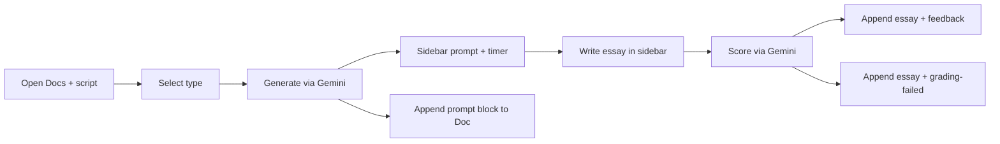
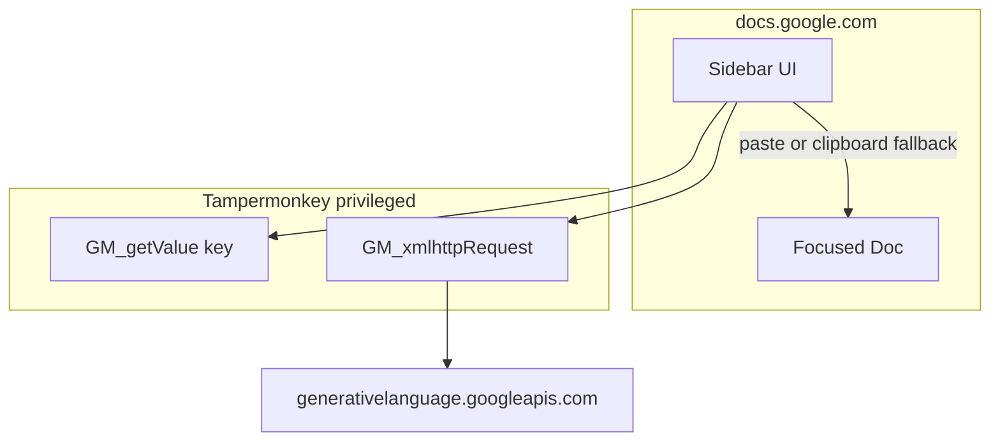

# Tampermonkey Google Docs Writing Practice - Plan

## Goal Capsule

- **Objective:** Deliver a Tampermonkey userscript that runs on Google Docs and provides a full TOEFL Writing practice loop—generate Email or Academic Discussion prompts via Gemini, practice in a sidebar with timer and word count, score with rubric-style feedback, and append results into the focused Doc—without running this repo’s frontend or backend.
- **Product authority:** This plan owns the userscript practice experience and Doc append-log behavior. The existing React/Express Writing app remains a separate product surface; Speaking and in-Doc primary editing are not active scope.
- **Product Contract preservation:** Product Contract unchanged (R1–R12, D1–D7, F1–F2, AE1–AE4 preserved). Planning resolved Deferred-to-Planning items into KTDs below.
- **Open blockers:** None.
- **Execution profile:** code — new `userscripts/` package; no FE/BE runtime coupling.
- **Stop conditions:** Stop if Docs append proves completely impossible without OAuth and the clipboard fallback cannot complete a readable session log; escalate rather than expanding into Google Docs API OAuth in v1.

---

## Product Contract

### Summary

A personal Tampermonkey script on Google Docs one-clicks Gemini question generation for Email and Academic Discussion, hosts practice in a sidebar (not the Doc body), scores essays with rubric-style feedback, and uses the currently focused Doc as an append-only practice log. v1 mirrors the existing Writing module’s practice intent; revise-and-re-score is reserved for later.

### Problem Frame

The repo’s Writing product already generates prompts, times practice, and grades essays, but it requires running frontend, backend, SQLite, and server-side Gemini. For solo practice, that stack is friction. The user wants the same loop with zero local services: call Gemini from the browser and keep lasting records in Google Docs.

### Key Decisions

- D1. **Sidebar is the editor; Doc is the save/log** — chosen after cost comparison of in-Doc typing vs sidebar. (session-settled: user-directed — chosen over write-in-Doc body: lower Docs DOM coupling while keeping Docs as storage.) Governs R4, R5, R8.
- D2. **Full generate → practice → score loop is v1 minimum** — cannot be cut further. (session-settled: user-directed — chosen over generate-only or practice-without-score.) Governs R1–R7.
- D3. **Both Email and Academic Discussion in v1.** (session-settled: user-directed — chosen over single-type v1.) Governs R2.
- D4. **Gemini API key stored once in Tampermonkey settings.** (session-settled: user-directed — chosen over paste-each-time.) Governs R9.
- D5. **Write prompt on generate; append essay + feedback on score; multi-session blocks append at Doc end.** (session-settled: user-directed — chosen over score-only write or one-Doc-per-attempt.) Governs R6, R7.
- D6. **Parity with existing Writing practice intent; Approach C revise-and-re-score reserved, not built in v1.** (session-settled: user-directed — chosen over exam-hard-lock v1 and over shipping revise loops in v1.) Governs R3, R5, R10.
- D7. **Soft countdown aligned with the web Practice page** — Email 420s, Academic 600s; writing past zero remains allowed. (Confirmed in scope synthesis.) Governs R5.
  - Note: `spec.md` lists Academic Discussion as 7 minutes; the live Practice UI uses 600s. This plan follows the Practice UI.

### Actors

- A1. Solo TOEFL Writing practicer (script installer; personal use).
- A2. Gemini API (question generation and essay evaluation).
- A3. Currently focused Google Doc (append-only practice log).

### Requirements

**Delivery and independence**

- R1. A1 can complete generate → practice → score → Doc update using only the userscript on Google Docs, with no dependency on this repo’s frontend, backend, or SQLite at runtime.

**Question generation**

- R2. A1 can choose Email or Academic Discussion and one-click generate a TOEFL-style prompt via Gemini, with difficulty and structure intent aligned to the existing Writing module’s generation behavior.
- R3. Generated prompt content appears in the sidebar practice surface before A1 starts typing the essay.

**Practice surface**

- R4. A1 composes the essay in a sidebar editor hosted by the userscript, not as the primary interaction in the Doc body.
- R5. During practice the sidebar shows a soft countdown (per D7) and a live word count; expiry does not hard-lock the editor.

**Doc logging**

- R6. On successful generate, the script appends a new session block containing the prompt at the end of the focused Doc.
- R7. On score, the script appends the essay text and rubric-style feedback into that session’s block (or completes the open block) in the focused Doc so the Doc remains a readable chronological log.
- R8. If the wrong Doc tab is focused at write time, content may land in that Doc; v1 accepts this personal-tool risk without cross-tab confirmation UI.

**Configuration and scoring**

- R9. A1 configures the Gemini API key once in Tampermonkey script settings; subsequent generate and score calls reuse it.
- R10. Scoring returns a 0–5 score in 0.5 steps plus actionable feedback categories aligned with the existing Writing evaluation intent (grammar, content development, and related rubric dimensions).
- R11. If scoring fails after the essay exists, the essay is still written to the Doc session block with an explicit grading-failed marker so practice work is not lost.

**Deferred capability (non-requirement for v1)**

- R12. v1 does not implement revise-and-re-score under the same session block; that capability is reserved for a later plan and must not block v1 delivery.

### Key Flows

- F1. Generate and start practice
  - **Trigger:** A1 opens Google Docs with the userscript active, has a configured API key, selects Email or Academic, clicks generate.
  - **Actors:** A1, A2, A3
  - **Steps:** Script calls Gemini for a typed prompt; shows prompt in sidebar; resets timer/word count for that type; appends a new session block with the prompt to the focused Doc.
  - **Outcome:** Sidebar is ready for typing; Doc has a new prompt section at the end.
  - **Covered by:** R1, R2, R3, R4, R5, R6, R9

- F2. Score and append results
  - **Trigger:** A1 finishes (or stops) writing and clicks score.
  - **Actors:** A1, A2, A3
  - **Steps:** Script sends sidebar essay plus prompt context to Gemini for evaluation; appends essay and feedback into the current session block; on evaluation failure, still appends essay with grading-failed marker.
  - **Outcome:** Doc session block contains prompt, essay, and either feedback or failure marker; sidebar remains usable for a new generate.
  - **Covered by:** R1, R7, R10, R11

### Acceptance Examples

- AE1. Happy path Email
  - **Covers:** R1, R2, R6, R7, R10
  - **Given:** Key configured; blank or existing Doc focused; Email selected
  - **When:** A1 generates, writes in sidebar, scores
  - **Then:** Doc end gains a session block with Email prompt, essay, and 0–5 (0.5-step) feedback; no FE/BE process was required

- AE2. Academic soft timer
  - **Covers:** R5, D7
  - **Given:** Academic session started (600s)
  - **When:** Timer reaches zero and A1 continues typing then scores
  - **Then:** Editor stays editable; score still runs; Doc still receives essay and feedback

- AE3. Grading failure preserves essay
  - **Covers:** R11
  - **Given:** Essay text present in sidebar; Gemini evaluation errors
  - **When:** A1 clicks score
  - **Then:** Essay is appended to the session block with an explicit grading-failed marker; prompt block from generate remains

- AE4. Multi-session append
  - **Covers:** R6, R7
  - **Given:** Doc already has one completed session block
  - **When:** A1 generates and scores a second time
  - **Then:** A second block is appended after the first; prior block content is unchanged

### Success Criteria

- A1 can install the script, set the key once, and complete at least one Email and one Academic full loop with lasting Doc records without starting this repo’s servers.
- Practice feel matches the existing Writing module’s intent closely enough that A1 does not need the web Practice page for routine drills.
- Doc history remains readable as chronological session blocks after several practices in one file.

### Scope Boundaries

**Deferred for later**

- Revise-and-re-score under the same Doc session block (Approach C).
- Typing analytics, revision diffs, and dashboard/history UI from the web app.
- Hard time-lock exam mode.
- Packaging beyond a Tampermonkey userscript (e.g. store extension).
- Google Docs REST API + OAuth for reliable inserts.

**Outside this product's identity**

- Running or requiring the React frontend, Express backend, or SQLite for practice.
- Speaking Interview module.
- Primary essay composition inside the Google Doc body.
- Multi-user key management or shared classroom deployment.

### Dependencies / Assumptions

- A1 has Tampermonkey (or compatible userscript manager) and a personal Gemini API key.
- Browser-direct Gemini calls are acceptable for personal use despite key exposure in the browser profile.
- Timer durations follow `frontend/src/pages/Practice.tsx` (Email 420s, Academic 600s), not the Academic 7-minute line in `spec.md`.
- Generation and evaluation product intent are sourced from the existing Writing module (`backend/src/services/gemini.ts` and related UX).
- Focused-Doc writes are best-effort; Google Docs DOM or paste fragility is an accepted personal-tool risk for v1.

### Outstanding Questions

**Resolve Before Planning**

- None.

**Deferred to Implementation**

- Exact Docs iframe selectors / paste event sequence may need tuning against current Docs DOM during U4 spike.
- Default Gemini model id if `gemini-1.5-flash` is retired — prefer matching backend `FALLBACK_GEMINI_MODEL` / env default at implement time.

### Sources / Research

- Existing Writing types, timers, and grade API behavior: `spec.md`, `frontend/src/pages/Practice.tsx`, `backend/src/services/gemini.ts`, `backend/src/index.ts`, `backend/src/lib/errorTypes.ts`.
- Product overview and FE/BE assumptions: `Readme.md`, `plan.md`.
- Grounding scan found no existing Tampermonkey / Google Docs integration in-repo.
- External: Tampermonkey `GM_xmlhttpRequest` + `@connect` bypasses browser CORS for Gemini; plain `fetch` to `generativelanguage.googleapis.com` fails CORS.
- External: Google Docs has no stable public DOM insert API; clipboard / texteventtarget-iframe paste is fragile; Docs REST+OAuth is the reliable alternative (deferred).

---

## Planning Contract

### Key Technical Decisions

- KTD1. **Standalone userscript package under `userscripts/gdocs-writing-practice/`** — zero runtime import from `frontend/` or `backend/`. (session-settled: user-approved — chosen over embedding in FE/BE or requiring `pnpm dev`.)
- KTD2. **Gemini via `GM_xmlhttpRequest` + `@connect generativelanguage.googleapis.com`; key via `GM_getValue`/`GM_setValue` (or Tampermonkey script values UI)** — plain page `fetch` cannot call Gemini due to CORS. (session-settled: user-directed — chosen over Docs API OAuth path for networking; confirms browser key storage.) Covers R1, R9.
- KTD3. **Port generate/evaluate prompt text and rubric categories from `backend/src/services/gemini.ts` into userscript string constants** — lightly adapt packaging only (REST JSON body); keep task specs, rubrics, six error categories, and `<essay_start>`/`<essay_end>` wrapping. Prefer verbatim intent over rewrite. Covers R2, R10.
- KTD4. **Pure helpers testable with Node/vitest outside Docs** — `normalizeScore`, JSON fence strip/parse, `normalizeErrorType`, word count, timer duration map, session-block text builders live in `lib/` modules imported by the userscript (or duplicated into a single `.user.js` with mirrored test files). Covers R5, R10, R11.
- KTD5. **Docs append = best-effort editor paste, then clipboard fallback** — attempt insert into Docs `docs-texteventtarget-iframe` / paste path; on failure copy the session fragment and show an in-sidebar “Paste into Doc (Cmd/Ctrl+V)” affordance. No Google Docs REST OAuth in v1. (session-settled: user-directed — chosen over Docs API + OAuth.) Covers R6, R7, R8.
- KTD6. **Session block is plain-text headings with fixed separators** — e.g. `=== TOEFL Writing Session ===`, type, ISO timestamp, `## Prompt`, `## Essay`, `## Score`, `## Feedback`, `## Errors`, `## GRADING FAILED` marker. Multi-session = append another full block at end. Covers R6, R7, AE4.
- KTD7. **Default model `gemini-1.5-flash` (or current backend fallback at implement time); request JSON MIME via REST `generationConfig.responseMimeType`** — align with `backend/src/services/gemini.ts` `FALLBACK_GEMINI_MODEL`. Optional model override in TM settings is nice-to-have, not required.

### High-Level Technical Design

- **Shell:** one `@match https://docs.google.com/document/*` userscript injects a fixed sidebar (type select, Generate, timer, word count, essay textarea, Score, status).
- **Session state (in-memory):** `type`, `title`, `prompt`, `essay`, `timerRemaining`, `sessionId` for correlating generate append vs score append.
- **Network:** POST `.../v1beta/models/{model}:generateContent?key=...` with generate or evaluate prompt text; parse JSON; normalize score/errors.
- **Doc writer:** `formatPromptBlock` / `formatScoreBlock` → `appendToDoc(text)` → try paste → else clipboard + UI prompt.

### Assumptions

- Personal single-user install; key leakage to the local browser profile is accepted.
- Violentmonkey / Tampermonkey both support `GM_xmlhttpRequest` and `@connect` sufficiently for v1.
- Clipboard fallback counts as satisfying R6/R7 when automatic paste fails, if the user completes one paste and the block text is complete.

### Implementation Constraints

- Do not add runtime dependency on Express, Prisma, React, or `@google/generative-ai` npm package inside the userscript.
- Do not commit API keys.
- Do not implement Speaking, typing analytics, or revise-and-re-score.
- Prefer fewest files: `lib/*.js` + one `.user.js` + `README.md` + tests.

### Sequencing

1. U1 pure helpers + tests (unblocks everything).
2. U2 Gemini client (needs U1 parsers).
3. U3 sidebar practice UI (needs U2).
4. U4 Docs append + install README (can spike paste early in parallel with U3 once U1 block format exists; integrate last).

---

## Implementation Units

### U1. Pure writing helpers and unit tests

- **Goal:** Ship portable helpers that encode Writing-module parity for timers, word count, score/error normalization, JSON extraction, and session-block text—without touching Docs or Gemini network.
- **Requirements:** R5, R10, R11 (text markers), R2/R10 prompt string ports prepared for U2
- **Dependencies:** None
- **Files:**
  - Create: `userscripts/gdocs-writing-practice/lib/timers.js`
  - Create: `userscripts/gdocs-writing-practice/lib/wordCount.js`
  - Create: `userscripts/gdocs-writing-practice/lib/score.js`
  - Create: `userscripts/gdocs-writing-practice/lib/jsonExtract.js`
  - Create: `userscripts/gdocs-writing-practice/lib/sessionBlock.js`
  - Create: `userscripts/gdocs-writing-practice/lib/prompts.js` (ported strings from `backend/src/services/gemini.ts`)
  - Create: `userscripts/gdocs-writing-practice/lib/*.test.js` (or colocated vitest files)
  - Create: `userscripts/gdocs-writing-practice/package.json` (minimal vitest) OR wire tests under backend/frontend only if lighter—prefer local package with `pnpm --filter` or `node --test` / vitest
- **Approach:** Port `normalizeScore`, fence-strip JSON parse, `CANONICAL_ERROR_TYPES` / `normalizeErrorType`, Email=420 / Academic=600, word count via trim+split, and block formatters. Mirror behaviors covered by `backend/src/services/gemini.test.ts` where applicable.
- **Patterns to follow:** `backend/src/services/gemini.ts`, `backend/src/lib/errorTypes.ts`, `frontend/src/pages/Practice.tsx` timer/word count
- **Test scenarios:**
  - Happy: Email duration 420, Academic 600; soft decrement stops at 0
  - Happy: word count matches Practice trim/split
  - Happy: scores clamp to 0–5 half-steps
  - Edge: JSON wrapped in markdown fences still parses
  - Edge: unknown error type normalizes to Elaboration (or same as backend)
  - Error: grading-failed block formatter includes essay + explicit marker
- **Verification:** Unit tests for helpers pass via the package’s test command (document exact command in README).
- **Execution note:** Proof-first on helpers—write failing tests for score/JSON/timer/word-count/block format before filling implementations.

### U2. Gemini generate and evaluate client

- **Goal:** Call Gemini generateContent for Email/Academic prompts and essay evaluation using privileged userscript HTTP and stored API key.
- **Requirements:** R1, R2, R9, R10, R11
- **Dependencies:** U1
- **Files:**
  - Create: `userscripts/gdocs-writing-practice/lib/geminiClient.js`
  - Modify: `userscripts/gdocs-writing-practice/toefl-writing-practice.user.js` (metadata: `@grant GM_xmlhttpRequest`, `GM_getValue`, `GM_setValue`, `@connect generativelanguage.googleapis.com`)
- **Approach:** Wrap `GM_xmlhttpRequest` in a Promise. Build REST URL with model from KTD7. Generate uses `prompts.js` + type; evaluate wraps essay in tags and returns `{ score, feedback, errors }` after U1 normalize. Surface clear errors when key missing. On evaluate throw, caller (U3) still persists essay via U1 marker (R11).
- **Patterns to follow:** Prompt bodies in `backend/src/services/gemini.ts:197-336`; timeout discipline similar to backend `withTimeout` (choose a simple client-side timeout).
- **Test scenarios:**
  - Happy: mock `GM_xmlhttpRequest` returns generate JSON → `{ title, content }`
  - Happy: mock evaluate JSON → normalized score + categories
  - Error: missing API key rejects before network
  - Error: non-JSON / schema-invalid response rejects with actionable message
  - Integration (optional mock): evaluate failure path leaves structured error for U3 to attach grading-failed marker
- **Verification:** Client unit tests with mocked XHR pass; no live key required in CI.
- **Execution note:** Characterization-friendly mocks; do not call live Gemini in automated tests.

### U3. Sidebar practice UI and session loop

- **Goal:** Inject a Docs sidebar that selects type, generates, shows prompt, soft-timers, word-counts, accepts essay text, and scores—wiring U2 and preparing text for U4.
- **Requirements:** R1–R5, R9–R11, F1–F2, AE1–AE3
- **Dependencies:** U2
- **Files:**
  - Create/Modify: `userscripts/gdocs-writing-practice/toefl-writing-practice.user.js`
  - Optional: `userscripts/gdocs-writing-practice/lib/sidebar.js` if splitting keeps the userscript readable
- **Approach:** Fixed-position panel on `docs.google.com/document/*`. State machine: idle → generating → practicing → scoring → idle. Disable double-submit while in flight. Timer interval soft-decrements; never disable textarea at 0. After successful generate, call Doc append hook (U4) with prompt block; after score (success or fail), call append with score/grading-failed block. Settings: open Tampermonkey values or a small “Set API key” control writing `GM_setValue`.
- **Patterns to follow:** Practice UX intent from `frontend/src/pages/Practice.tsx` (timer, words, save&grade), not its React structure.
- **Test scenarios:**
  - Happy: UI state transitions documented via small pure reducer tests if extracted
  - Edge: timer at 0 still allows Score
  - Error: generate failure shows status; does not wipe prior Doc sessions
  - Error: score failure still triggers grading-failed append payload
- **Verification:** Reducer/helper tests if extracted; manual smoke listed under Verification Contract.
- **Execution note:** Prefer extracting a tiny pure state helper for testability; keep DOM injection thin.

### U4. Docs append writer and install README

- **Goal:** Append session fragments to the focused Google Doc with paste-first and clipboard fallback; document install and smoke steps.
- **Requirements:** R6, R7, R8, AE1, AE4
- **Dependencies:** U1 (block format); integrates with U3
- **Files:**
  - Create: `userscripts/gdocs-writing-practice/lib/docsAppend.js`
  - Create: `userscripts/gdocs-writing-practice/README.md`
  - Modify: root `Readme.md` (short pointer to userscript install—optional, keep minimal)
- **Approach:** Spike early: focus Docs editor iframe, insert/paste plain text at end (Ctrl/Cmd+End then paste if feasible). On failure, `navigator.clipboard.writeText` + sidebar banner requiring user paste. Never throw away generated text if paste fails. Document `@grant` list, `@connect`, key setup, and throwaway-Doc smoke checklist (Email + Academic, timer past zero, forced grade fail).
- **Patterns to follow:** None in-repo; treat Docs DOM as unstable—isolate behind `docsAppend.js`.
- **Test scenarios:**
  - Happy: `docsAppend` returns `{ method: 'paste' | 'clipboard' }` for caller UI
  - Edge: empty text no-ops safely
  - Manual AE1/AE4 on a throwaway Doc
- **Verification:** Automated tests cover clipboard/paste decision helpers where mockable; manual checklist in README completed by implementer before done.
- **Execution note:** Spike Docs paste in the first half of this unit; if paste is dead, ship clipboard fallback without expanding to OAuth.

---

## Verification Contract

| Gate | Command / action | Applies |
|------|------------------|---------|
| Helper + client unit tests | Package test command documented in `userscripts/gdocs-writing-practice/README.md` (prefer `pnpm test` from that package or `node --test`) | Every PR touching userscript libs |
| Existing monorepo suite | `pnpm test` at repo root | Ensure no accidental FE/BE breakage if root README touched |
| Manual Docs smoke | README checklist: install script → set key → Email full loop → Academic full loop → timer past 0 still scores → simulate grade fail → two sessions append | Before claiming feature complete |
| No FE/BE required | Confirm smoke never starts `pnpm dev` / backend | R1 |

Automated browser E2E against Google Docs is out of scope.

---

## Definition of Done

- All units U1–U4 complete with their Verification signals green.
- R1–R11 satisfied; R12 explicitly not implemented.
- AE1–AE4 covered by automated tests and/or documented manual smoke evidence.
- README enables a cold install on Tampermonkey without reading this plan.
- No API keys committed; abandoned spike code removed.
- Product Contract decisions D1–D7 and KTDs KTD1–KTD7 honored (no OAuth Docs API; no in-Doc primary editor; no Speaking).

---

## Risks & Dependencies

| Risk | Mitigation |
|------|------------|
| Docs paste breaks after Google UI change | Isolate in `docsAppend.js`; clipboard fallback is first-class success path |
| Gemini model id deprecated | Read backend fallback at implement time; make model a TM setting if needed |
| Prompt drift vs `gemini.ts` | Comment source line ranges in `prompts.js`; optional follow-up shared package deferred |
| API key in browser profile | Personal-use only; README warning |
| CORS if someone uses `fetch` | Enforce `GM_xmlhttpRequest` in code review |
